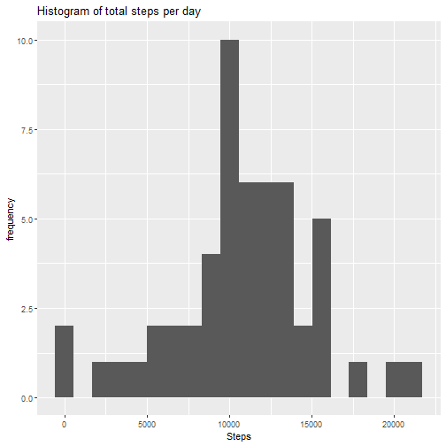
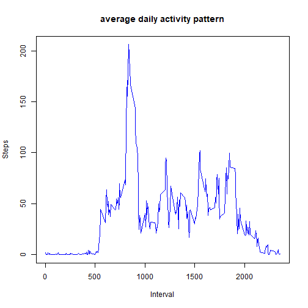
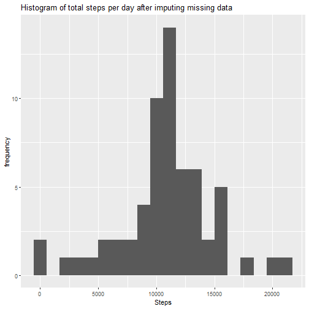
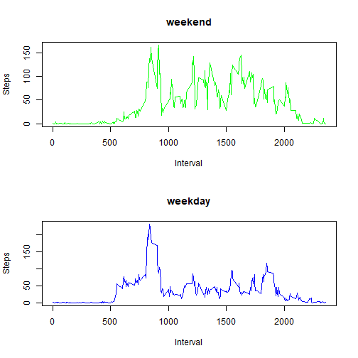

Aayush Shah
============
Introduction
============
It is now possible to collect a large amount of data about personal movement using activity monitoring devices such as a Fitbit, Nike Fuelband, or Jawbone Up. These type of devices are part of the “quantified self” movement – a group of enthusiasts who take measurements about themselves regularly to improve their health, to find patterns in their behavior, or because they are tech geeks. But these data remain under-utilized both because the raw data are hard to obtain and there is a lack of statistical methods and software for processing and interpreting the data.

This assignment makes use of data from a personal activity monitoring device. This device collects data at 5 minute intervals through out the day. The data consists of two months of data from an anonymous individual collected during the months of October and November, 2012 and include the number of steps taken in 5 minute intervals each day.

The data for this assignment can be downloaded from the course web site:
[Activity Monitoring Data](https://d396qusza40orc.cloudfront.net/repdata%2Fdata%2Factivity.zip)


The variables included in this dataset are:

1) steps: Number of steps taking in a 5-minute interval (missing values are coded as NA
2) date: The date on which the measurement was taken in YYYY-MM-DD format
3) interval: Identifier for the 5-minute interval in which measurement was taken.

The dataset is stored in a comma-separated-value (CSV) file and there are a total of 17,568 observations in this dataset.

Analysis
============

**The following code downloads the zip file if it is not present in the working directory and unzips it.**


```r
filename <- "activity.zip"
if (!file.exists(filename)){
  url<-"https://d396qusza40orc.cloudfront.net/repdata%2Fdata%2Factivity.zip"
  download.file(url, filename, method="curl")
}  
#extracts contents of the zip file
if (!file.exists("activity.csv")) { 
  unzip(filename) 
}
```

**Loading the libraries to be used:**


```r
library(dplyr)
library(ggplot2)
library(knitr)
library(lattice)
```

**Reading the data from the csv file:**


```r
activitydata<-read.csv("activity.csv",sep=",")
```

**Finding mean total number of steps taken per day, ignoring NA values and plotting it on a histogram.**


```r
stepsperday<-summarise(group_by(activitydata,date),steps=sum(steps))
qplot(stepsperday$steps,bins=20,main="Histogram of total steps per day",xlab = "Steps",ylab = "frequency")
```

```
## Warning: Removed 8 rows containing non-finite values
## (stat_bin).
```



**Calculating the mean and median of the number of steps taken per day.**


```r
mean(stepsperday$steps,na.rm = TRUE)
```

```
## [1] 10766.19
```

```r
median(stepsperday$steps,na.rm = TRUE)
```

```
## [1] 10765
```

**Calculating and plotting average daily pattern.**


```r
meandailyactivity<-summarise(group_by(activitydata,interval),steps=mean(steps,na.rm = TRUE))
plot(meandailyactivity$interval,meandailyactivity$steps,type = "l",col="blue",main = "average daily activity pattern",xlab = "Interval",ylab = "Steps")
```



**5-minute interval containing the maximum number of steps (averaged across all days)**


```r
meandailyactivity[which.max(meandailyactivity$steps),]$interval
```

```
## [1] 835
```

**Now to input missing values, first calculating the number of NA values;**


```r
missingvalues<-sum(is.na(activitydata$steps))
missingvalues
```

```
## [1] 2304
```

**Inputting missing values by using mean for that 5 minute interval**


```r
impdata<-activitydata
for(i in 1:nrow(impdata)){
  if (is.na(impdata$steps[i])){
    impdata$steps[i] <- meandailyactivity[which(impdata$interval[i] == meandailyactivity$interval), ]$steps
  }
}
```

**Now confirming that new data set called impdata doesnt have NA values**


```r
sum(is.na(impdata))
```

```
## [1] 0
```

**Now plotting histogram of the total number of steps taken each day after imputing missing data**


```r
stepsperday2<-summarise(group_by(impdata,date),steps=sum(steps))
qplot(stepsperday2$steps,bins=20,main="Histogram of total steps per day after imputing missing data",xlab = "Steps",ylab = "frequency")
```



**Now the new mean and median after imputing NA values are;**


```r
mean(stepsperday2$steps,na.rm = TRUE)
```

```
## [1] 10766.19
```

```r
median(stepsperday2$steps,na.rm = TRUE)
```

```
## [1] 10766.19
```

**Now confirming that the mean and median values before and after imputing the data do differ slightly**

Before filling the data

Mean : 10766.189

Median: 10765

After filling the data

Mean : 10766.189

Median: 10766.189

We see that the values after filling the data mean and median are equal.

**Now finding differences in activity patterns between weekdays and weekends**

First creating a new column in impdata called weekdays which says if the date on which the data was recorded was a weekday or a weekend


```r
weekdaysvector<-c("Monday","Tuesday","Wednesday","Thursday","Friday")
datevar<-as.Date(impdata$date)
weekdaysempty<-vector()
for(i in 1:length(datevar)){
  if(weekdays(datevar[i]) %in% weekdaysvector){
    weekdaysempty[i]<-"weekday"
  } else{
    weekdaysempty[i]<-"weekend"
  }
}
impdata$weekdays<-weekdaysempty
```

**Now creating subsets of impdata for weekdays and weekends**


```r
weekdayset<-subset(impdata,impdata$weekdays=="weekday")
weekendset<-subset(impdata,impdata$weekdays=="weekend")
```

**Now finding mean daily activities for weekdays and weekends**


```r
meanweekday<-summarise(group_by(weekdayset,interval),steps=mean(steps,na.rm = TRUE))
meanweekend<-summarise(group_by(weekendset,interval),steps=mean(steps,na.rm = TRUE))
```

**Now Plotting the mean daily activities for weekdays and weekends**


```r
par(mfrow=c(2,1))
plot(meanweekend$interval,meanweekend$steps,type = "l",col="green",xlab = "Interval",ylab = "Steps",main="weekend")
plot(meanweekday$interval,meanweekday$steps,type = "l",col="blue",main = "weekday",xlab = "Interval",ylab = "Steps")
```



We can see at the graph above that activity on the weekday has the greatest peak from all steps intervals. But, we can see too that weekends activities has more peaks over a hundred than weekday. This could be due to the fact that activities on weekdays mostly follow a work related routine, where we find some more intensity activity in little a free time that the employ can made some sport. In the other hand, at weekend we can see better distribution of effort along the time.


